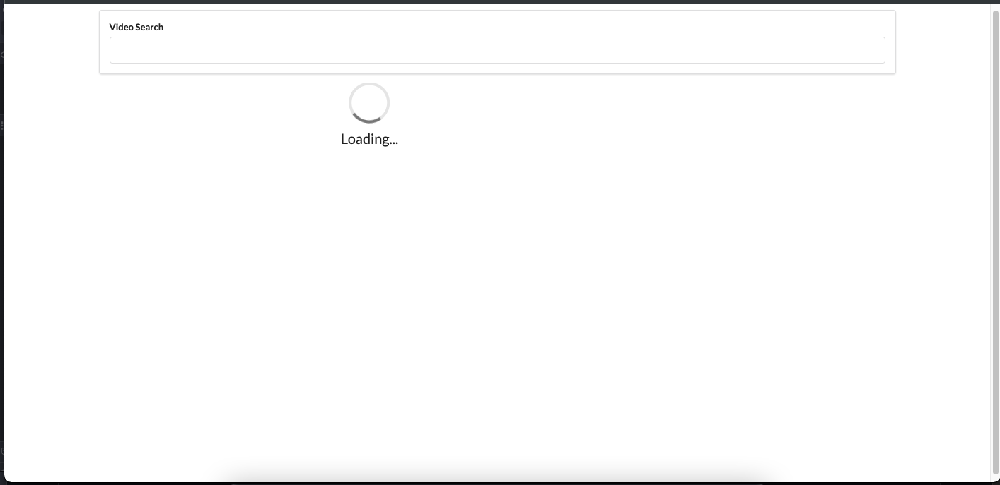

# VideoBrowser React App
### By Devon Acree-Meza

A basic React based video browsing application. 

* Access YouTube API using Axios to make the promise bassed HTTP requests
* Semantic UI framework

#### Practice with
* Updating state with fetched data
* Passing state as props
* Rendering lists
* Communicating from child to parent
* Conditional rendering
* Lifecycle methods

